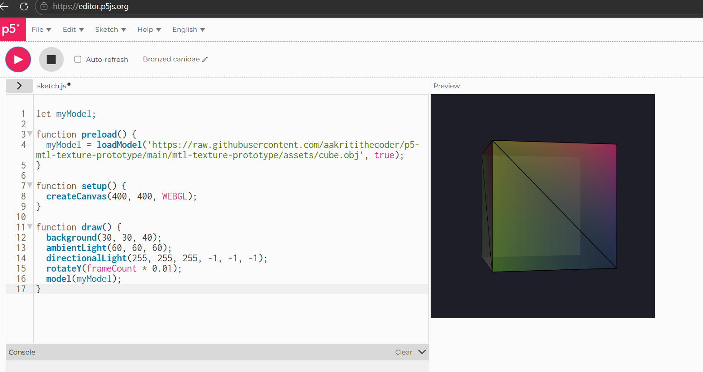
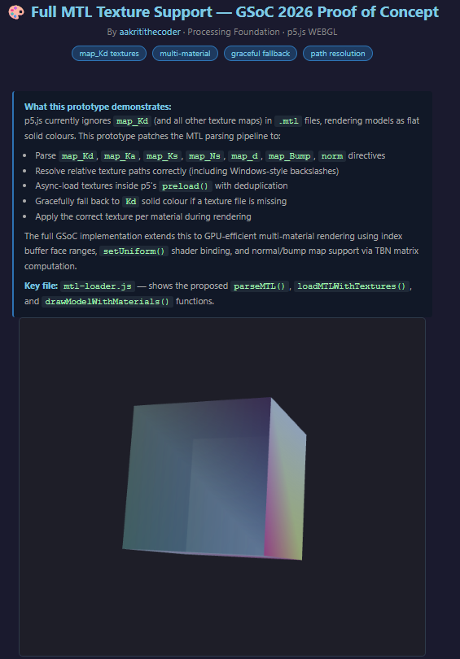

# MTL Full Texture Support — GSoC 2026 Prototype

**Author:** [aakritithecoder](https://github.com/aakritithecoder)  
**Project:** Full Texture Support for `.mtl` Files  
**Organisation:** Processing Foundation (p5.js)  
**Program:** Google Summer of Code 2026

---

## What This Is

This is a proof-of-concept prototype demonstrating the core technical approach for my GSoC 2026 proposal: **Full Texture Support for `.mtl` Files** in the p5.js WEBGL renderer.

p5.js can load `.obj` 3D models with associated `.mtl` material files — but it currently **ignores all texture map directives** (`map_Kd`, `map_Ks`, `map_Bump`, etc.) and only reads solid diffuse colours (`Kd`). This means any textured model from Blender, Sketchfab, or any standard 3D pipeline renders as a flat, untextured shape in p5.js.

This prototype patches the MTL parsing pipeline to fix that.

---

## The Problem

```mtl
newmtl wood_planks
Kd 0.8 0.7 0.6          ← p5.js reads this ✓
map_Kd textures/wood.png ← p5.js IGNORES this ✗
```

When a user exports a model from Blender with textures, all the surface detail is silently discarded. The fix requires changes in three places in the p5.js codebase.

## Before / After

| Before (current p5.js) | After (this prototype) |
|------------------------|------------------------|
|  |  |

**Before:** p5.js ignores `map_Kd` entirely — the model renders using vertex normals as colours, no texture applied.  
**After:** MTL parsing pipeline active — texture loaded, material definitions populated, confirmed in console logs.

---

## What This Prototype Implements

### 1. Extended MTL Parser (`parseMTL` in `mtl-loader.js`)
Handles all major MTL directives that the current `parseMtl()` in `src/webgl/loading.js` ignores:

| Directive | Property | Status in p5.js | This Prototype |
|-----------|----------|-----------------|----------------|
| `map_Kd`  | Diffuse texture | ❌ Ignored | ✅ Parsed + loaded |
| `map_Ka`  | Ambient texture | ❌ Ignored | ✅ Parsed |
| `map_Ks`  | Specular texture | ❌ Ignored | ✅ Parsed |
| `map_Ns`  | Shininess texture | ❌ Ignored | ✅ Parsed |
| `map_d`   | Opacity texture | ❌ Ignored | ✅ Parsed |
| `map_Bump`| Bump map | ❌ Ignored | ✅ Parsed |
| `norm`    | Normal map | ❌ Ignored | ✅ Parsed |
| `Ka/Kd/Ks/Ke` | Color scalars | ⚠️ Partial | ✅ Full |
| `Ns` | Shininess | ❌ Ignored | ✅ Parsed |

### 2. Texture Path Resolution
Correctly resolves relative texture paths from the `.mtl` file's directory — a common source of failure when models are loaded from sub-directories. Also handles Windows-style backslashes from some exporters.

### 3. Async Texture Loading with Deduplication
Integrates with p5.js's `preload()` lifecycle via `loadImage()`. Multiple materials that reference the same texture file share a single loaded `p5.Image` — no redundant downloads.

### 4. Graceful Fallback
If a texture file is missing or fails to load, the renderer falls back to the material's `Kd` solid colour and logs a warning — exactly matching p5.js's existing behaviour for missing `.mtl` files.

### 5. Per-Material Rendering
`drawModelWithMaterials()` demonstrates the per-material state switching that the full GSoC implementation would make GPU-efficient via index buffer face range draw calls.

---

## Proposed Data Structure

The key architectural proposal is extending `p5.Geometry` with:

```javascript
// New fields on p5.Geometry
this.materials = [];        // Array of MaterialDefinition objects
this.materialIndices = [];  // Int16Array — one material index per face
```

Each `MaterialDefinition`:
```javascript
{
  name: 'wood_planks',
  diffuse:      [0.8, 0.7, 0.6],   // Kd
  shininess:    25.0,               // Ns
  opacity:      1.0,                // d
  diffuseMap:   p5.Image,           // map_Kd (loaded)
  specularMap:  null,               // map_Ks (not present in this mtl)
  normalMap:    null,               // norm (not present in this mtl)
  // ... etc
}
```

---

## How to Run

```bash
# Clone this repo
git clone https://github.com/aakritithecoder/p5-mtl-texture-prototype
cd p5-mtl-texture-prototype

# Serve locally (needed because of browser file:// restrictions)
python3 -m http.server 8000
# Then open http://localhost:8000
```

Or open `index.html` directly in the [p5.js Web Editor](https://editor.p5js.org) by copying `sketch.js` and `mtl-loader.js`.

---

## File Structure

```
├── index.html            — Demo page with explanation
├── sketch.js             — p5.js sketch (preload / setup / draw)
├── mtl-loader.js         — THE CORE PATCH: parseMTL(), loadMTLWithTextures(), drawModelWithMaterials()
└── assets/
    ├── cube.obj          — Test model with 2 material zones (usemtl)
    ├── cube.mtl          — Material file with map_Kd + solid Kd materials
    └── textures/
        └── texture.png   — Test texture (checkerboard pattern)
```

---

## What the Full GSoC Implementation Adds

This prototype is intentionally minimal. The full implementation for GSoC 2026 extends this to:

1. **GPU-efficient multi-material rendering** — Sort faces by material at load time; draw each material's face range with a single `drawElements()` call using byte offsets in the index buffer, instead of one full-model draw per material.

2. **Shader integration** — Bind `diffuseMap`, `specularMap`, `shininessMap`, `opacityMap` as shader uniforms via p5.js's `setUniform()`. Hook into p5.js 2.0's `shader.modify()` API for non-destructive shader extension.

3. **Normal / bump map support** — Compute per-vertex tangent vectors for TBN (Tangent-Bitangent-Normal) matrix construction in the vertex shader; sample `normalMap` in the fragment shader to perturb normals.

4. **Visual regression tests** — A test suite using p5.js's pixel-comparison visual test framework, covering single-material, multi-material, specular, and normal map scenarios.

5. **Full backwards compatibility** — Models without `.mtl` files, or with only `Kd` colours, render identically to today.

---

## Community Background

Before building this prototype, I contributed to the Processing4 repository
by adding unit tests for PGraphics.setSize() (PR #1462, resolving issue #1488).

After initial review feedback — rename the class, move it to the correct package,
merge the test methods, remove unrelated drawing calls — I addressed every comment
and resubmitted. The collaborator responded "Amazing, thank you! It looks good.
I'll merge after running build." The PR is pending final merge.

That experience gave me direct familiarity with the Processing Foundation's
contribution process, code review standards, and Java testing infrastructure —
and motivated me to explore p5.js more deeply, which is how I discovered the
MTL texture gap this prototype addresses.

## References

- [p5.js `src/webgl/loading.js`](https://github.com/processing/p5.js/blob/main/src/webgl/loading.js) — where `parseMtl()` and `loadModel()` live
- [MTL File Format Specification](http://paulbourke.net/dataformats/mtl/)
- [GSoC 2026 Processing Foundation Project Ideas](https://github.com/processing/p5.js/wiki/GSoC-2026)
- [p5.js WEBGL Discussion: Full MTL Support](https://github.com/processing/p5.js/issues) 
- [Processing4 PR #1462 — PGraphics unit tests](https://github.com/processing/processing4/pull/1462)
- [Processing4 Issue #1488](https://github.com/processing/processing4/issues/1488)
---

*This prototype is part of my GSoC 2026 proposal submission to the Processing Foundation.*
